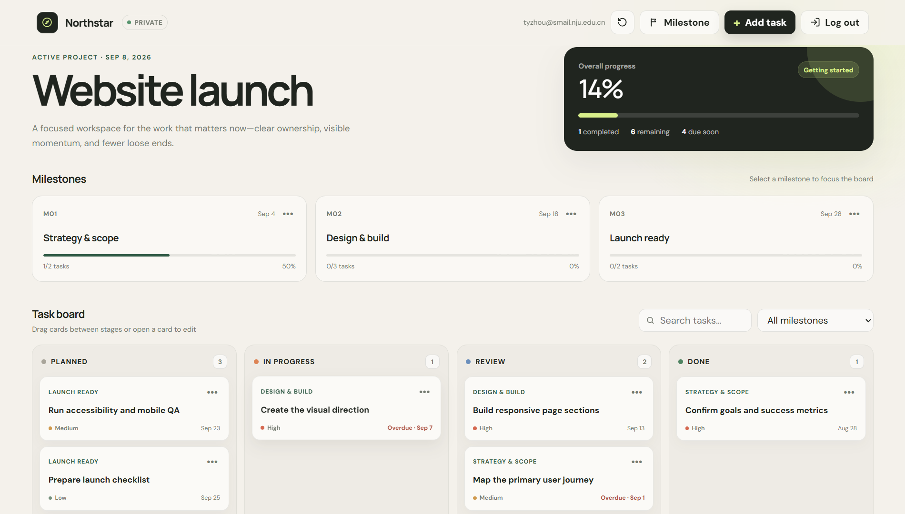

<div align="center">
  <h1>Northstar 项目规划工具</h1>
</div>


<p align="center">
<a href="README.md">English</a> | 中文 <br>
  一个私密、云端持久化的项目规划工具，帮助用户把阶段目标拆解成清晰、可追踪的工作。<br>
  欢迎来体验 <a href="https://northstar-zhou.vercel.app" target="_blank">该应用</a>
</p>


## 



工作台由三个相互关联的规划层级组成：

- **项目概览**展示总体完成率、已完成任务、剩余任务和近期截止事项。
- **里程碑**把项目划分为具有目标日期的阶段性检查点，并自动计算每个阶段的进度。
- **任务看板**把具体工作组织在“计划中、进行中、审核中、已完成”四个阶段，支持筛选、编辑和拖拽流转。

## 功能亮点

- 邮箱 OTP 无密码认证与数据库级用户隔离
- 基于 Supabase PostgreSQL 的跨设备云端持久化
- 项目、里程碑、任务三级规划与拖拽流转
- 完整的加载、保存、断网恢复和会话失效状态

## 本地运行

运行要求：Node.js 22 LTS，以及一个已经执行项目迁移文件的 Supabase 项目。

```bash
npm install
```

根据 `.env.example` 创建 `.env.local`，并填写：

```ini
VITE_SUPABASE_URL=你的-Supabase-项目地址
VITE_SUPABASE_PUBLISHABLE_KEY=你的-Supabase-公开客户端密钥
```

启动开发服务器：

```bash
npm run dev
```

## 构建

生成正式构建：

```bash
npm run build
```

同时执行正式构建与发布安全检查：

```bash
npm run check:release
```

发布检查会验证正式构建、公开环境变量契约、旧本地数据源是否移除、私有环境文件是否被 Git 跟踪，以及源码和浏览器产物中是否包含服务端密钥特征。

## 核心技术介绍

Northstar 是一个基于 Vue 3、Vue Router、Composable 状态编排和 Repository 数据层构建的单页应用。Supabase 提供邮箱 OTP 认证、PostgreSQL 持久化、自动数据接口、事务数据库函数与行级安全策略；用户归属由数据库强制校验，不依赖前端筛选。工作区初始化和重置通过原子 RPC 完成，日常操作采用行级 CRUD，避免覆盖整份状态。界面明确处理加载、保存、断网失败、空数据和会话过期。Vite 负责构建，Vercel 托管静态前端，整体保持轻量 Serverless 架构，并为未来通过受保护服务端函数接入 AI 规划辅导保留扩展路径。

## 功能文档

| 文档 | 内容 |
|---|---|
| [架构与交付规划](docs/phase-1-architecture-and-delivery.md) | 架构、路由语义、项目边界与交付门槛 |
| [数据库结构](docs/database-schema.md) | 数据表、约束、索引、迁移与结构测试 |
| [用户数据隔离](docs/user-isolation.md) | RLS 策略与双用户安全验证 |
| [邮箱验证码认证](docs/email-otp-auth.md) | Supabase Auth 配置与认证测试 |
| [云端规划数据](docs/cloud-planner-data.md) | 数据映射、生命周期 RPC 与持久化测试 |
| [可靠页面状态](docs/resilient-ui-states.md) | 加载、保存、失败恢复与会话失效测试 |
| [发布准备检查](docs/release-readiness.md) | 构建、依赖、密钥、浏览器与部署检查 |

## 部署

前端面向 Vercel 部署，认证和业务数据由 Supabase 托管。为支持单页应用路由，所有应用路径都需要回退到 `index.html`。

正式部署前需要：

1. 执行全部 Supabase 数据库迁移。
2. 在 Vercel 配置两个公开环境变量。
3. 设置 Supabase Site URL 和允许的跳转地址。

## 当前范围

Northstar 当前为每位用户提供一个默认工作区。数据库模型已经允许未来支持多个项目，但现有界面暂不提供项目切换功能。

AI 工作规划辅导以及可能的 DeepSeek 接入属于后续迭代，应通过受保护的 Serverless Function 实现。

## 许可证

本项目使用 [MIT License](LICENSE)。